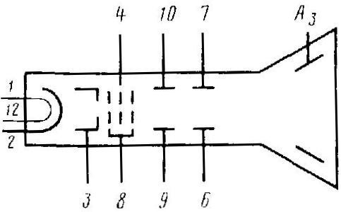

# Additional information

## Main parameters of the device Single beam tube 7LO1M

| Parameter                                                                                                      |  Min |  Max | Unit             |
|----------------------------------------------------------------------------------------------------------------|-----:|-----:|------------------|
| Glow current                                                                                                   | 0.54 | 0.66 | A                |
| Modulation                                                                                                     |      |   70 | V                |
| Current of the first anode                                                                                     | -100 |  200 | μA               |
| Second anode current                                                                                           |      |  500 | µA               |
| Leakage current between the cathode and the heater (with the heater voltage of -135 V relative to the cathode) |      |   30 | μA               |
| Leakage current in the modulator circuit                                                                       |      |    5 | μA               |
| Leakage current in the circuit of the first anode                                                              |      |   10 | μA               |
| Sensitivity                                                                                                    |      | 0.11 | m\/V             |
| Temporary deflection plates X1, X2                                                                             | 0.07 | 0.11 |                  |
| signal deflecting plates U1 U2                                                                                 | 0.08 | 0.13 |                  |
| Screen brightness                                                                                              |  0.5 |      | cd/m2 |
| Operating time                                                                                                 |  600 |      | h                |
| Service life criteria:                                                                                         |      |      |                  |
| &nbsp;&nbsp; Width of the focused line in the center of the screen                                             |      |  0.7 | mm               |
| Capacitance between electrodes:                                                                                |      |      |                  |
| &nbsp;&nbsp; modulator - all electrodes                                                                        |      |   10 | pF               |
| &nbsp;&nbsp; cathode - all electrodes                                                                          |      |   10 | pF               |
| &nbsp;&nbsp; plate X1 - plate X2                                                                               |      |    3 | pF               |
| &nbsp;&nbsp; plate U1 - plate U2                                                                               |      |    3 | pF               |
| &nbsp;&nbsp; plate X1 - all electrodes                                                                         |      |   10 | pF               |
| &nbsp;&nbsp; plate U1 - all electrodes                                                                         |      |   10 | pF               |
| &nbsp;&nbsp; plate X1 - all electrodes except X2                                                               |      |    8 | pF               |
| &nbsp;&nbsp; plate X2 - all electrodes except X1                                                               |      |    8 | pF               |
| &nbsp;&nbsp; plate U2 - all electrodes except U1                                                               |      |    8 | pF               | 

## Limiting performance data single-beam tube 7LO1M

| Parameter                                                                               |  Min |  Max | Unit |
|-----------------------------------------------------------------------------------------|-----:|-----:|------|
| Heating voltage                                                                         |  5.7 |  6.9 | V    |
| Voltage of the first anode                                                              |      |  550 | V    |
| Voltage of the second anode                                                             | 1000 | 1500 | V    |
| Voltage of the third anode                                                              | 1300 | 3000 | V    |
| Modulator voltage                                                                       | -200 |    0 | V    |
| Heater voltage relative to the cathode                                                  | -125 |    0 | V    |
| Voltage between any of the deflecting plates and the second anode                       | -450 |  450 | V    |
| The ratio of the voltage of the third anode to the voltage of the second anode          |      |    2 |      |
| Resistance in the modulator circuit                                                     |      |  1.5 | MΩ   |
| Total resistance in the circuit of any of the deflecting plates at a frequency of 50 Hz |      |    1 | MΩ   |
