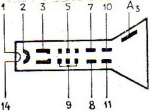

# ELECTRONIC BEAM TUBE 8LO39V

## 1 GENERAL INFORMATION

Cathode-ray tube 8L039V with electrostatic focusing and deflection of the electron beam, with a long afterglow of
yellow-orange color, designed to register electrical processes by visual observations in various radio engineering
devices.

|           Pin | Name of electrodes            |
|--------------:|-------------------------------|
|             1 | Heater                        |
|             2 | Cathode                       |
|             3 | Modulator                     |
|             4 | Not connected                 |
|             5 | First anode                   |
|             6 | Absent                        |
|             7 | Signal plate Y1    |
|             8 | Signal plate Y2    |
|             9 | Second anode                  |
|            10 | Temporary plate X1 |
|            11 | Temporary plate X2 |
|            12 | Not connected                 |
|            13 | Absent                        |
|            14 | Heater                        |
| A3 | Third anode                   |

## 2 Operating Conditions

CRTs allow operation under conditions of exposure to the following mechanical loads:

* vibration loads in the frequency range from 1 to 1000 Ng with acceleration up to 98.1 m/s2 (10 G);
* Multiple shocks with acceleration up to 343 m/s2 (35 G) with duration of impact 1 - 80 ms.

CRTs allow operation under conditions of exposure to the following other climatic factors:

* temperature of air or other gas (except aggressive) from 213 up to 358 K;
* relative air humidity up to 98% at temperatures up to 308 K;
* reduced atmospheric pressure 12000 Pa;
* high air pressure 297,198 Pa.

## 3 BASIC TECHNICAL DATA

### 3.1 Electrical and lighting parameters

| Parameter                                              |    Value    | Unit             |
|--------------------------------------------------------|:-----------:|------------------|
| Filament voltage                                       |     6.3     | V                | 
| Filament current                                       | 0.54 - 0.66 | A                |
| Voltage at the 1st anode                               |  320 - 480  | V                |
| Voltage at the 2nd anode                               |    2000     | V                |
| Voltage at the 3rd anode                               |    4000     | V                |
| Blocking voltage                                       |  -90 - -30  | V                |
| Maximum focused line width in the center of the screen |    0.75     | mm               |
| Maximum modulation voltage                             |     45      | V                |
| Minimum screen brightness                              |     45      | cd/m2 |
| Sensitivity to deflection of temporary plates          | 0.13 - 0.20 | mm/V             |
| Sensitivity to deflection of signal plates             | 0.14 - 0.21 | mm/V             |

### 3.2 Electrical parameters after 600 h of operation

| Parameter                                              | Value | Unit             |
|--------------------------------------------------------|:-----:|------------------|
| Maximum focused line width in the center of the screen |  1.1  | mm               |
| Maximum modulation voltage                             |  50   | V                |
| Maximum parasitic luminescence brightness              |  0.2  | cd/m2 |
| Minimum screen brightness                              |  40   | cd/m2 |

### 3.3 Limit values of permissible operating conditions

| Parameter                                                                                |    Value    | Unit |
|------------------------------------------------------------------------------------------|:-----------:|------|
| Filament voltage                                                                         |  5.6 - 6.9  | V    | 
| Maximum voltage at the 1st anode                                                         |    1100     | V    |
| Voltage at the 2nd anode                                                                 | 1500 - 2000 | V    |
| Voltage at the 3rd anode                                                                 | 3000 - 4400 | V    |
| Voltage cathode heater                                                                   |  -125 - 0   | V    |
| Maximum modulation voltage                                                               |  -200 - 0   | V    |
| Maximum resistance in the modulator circuit                                              |     1.5     | GΩ   |
| Voltage between any of the deflection plates of the 2nd anode                            | -550 - 550  | V    |
| Maximum impedance in the circuit of any of the deflection plates at a frequency of 50 Hz |     1.0     | MΩ   |
| Maximum ratio of the voltage at the 3rd anode to the voltage at the 2nd anode            |     2.3     |      |

### 3.4 Design data

| Parameter                            | Value | Unit |
|--------------------------------------|:-----:|------|
| Maximum weight                       |  500  | g    |
| Dimensions:                          |       |      |
| &nbsp;&nbsp; Maximum length          |  274  | mm   |
| &nbsp;&nbsp; Maximum screen diameter |  78   | mm   |

## 4 INSTRUCTIONS FOR USE AND OPERATION

* It is not allowed to operate the CRT at the same time with two or more the maximum permissible values of the
  parameters of electrical modes.
* CRTs should be fixed in the equipment using shock-absorbing shims.
* Direct contact of the CRT cylinder with metal parts of equipment.
* When developing electronic equipment, it is recommended to provide watch automatic locking of the electron beam for
  warning CRT failure when the scan generator is not working (at the moment of switching on and turning off electronic
  equipment or in the event of a generator failure, vertices).
* It is recommended to provide for the protection of electronic equipment from short-term CRT breakdowns that do not
  lead to failure.

## 5 STORAGE

Storage of CRTs should be carried out in the manufacturer's packaging or mounted in equipment in heated warehouses at
temperatures from 278 to 313 K and relative humidity up to 80% at a temperature of 298 K.

## FOR INFORMATION

Devices designed to work in countries with a tropical climate, external metal parts are covered with petroleum jelly to
protect against corrosion, and therefore, when putting the devices into operation, you should first remove the layer of
petroleum jelly.

## Addendum

Specifications

* 8LO39V single-beam tube (8LO-39V, 8LO 39V, 8L039V, 8L0-39V, 8L0 39V)
* For visual observation of single or slowly changing electrical processes in radio electronic devices.
* Screen glow color - blue.
* The screen persistence is yellow.
* The diameter of the working part of the screen is not less than 64mm.

Single-beam tube 8LO39V with one post-acceleration stage, with a round screen with a convex surface. Single-beam tubes
8LO39V are intended for visual observation of single or slowly changing electrical processes in electronic devices.
Screen glow color - blue. The screen persistence is yellow. The diameter of the working part of the screen is not less
than 64 mm. The width of the focused line in the center of the screen is no more than 0.75mm, at a point spaced from the
center of the screen by 3/8 of the diameter of the working part of the screen, no more than 1 mm.

Main parameters of the device single-beam tube 8LO39V at Un = 6.3V; Ual = 320 ... 480V; Ua2 = 2kV; Ua3 = 4kV; U3an = - (
30 ... 90) V

| Parameter                                                                                                         |    Value    | Unit             |
|-------------------------------------------------------------------------------------------------------------------|:-----------:|------------------|
| Filament current                                                                                                  | 0.54 - 0.66 | A                |
| Modulation                                                                                                        |     50      | V                |
| First anode current                                                                                               | -150 - 500  | µA               |
| Second anode current                                                                                              |    1500     | µA               |
| Maximum leakage current between the cathode and the heater (at a heater voltage of -135V relative to the cathode) |     30      | µA               |
| Maximum leakage current in the modulator circuit                                                                  |      5      | µA               |
| Maximum leakage current in the first anode circuit                                                                |     15      | µA               |
| Sensitivity of temporary deflecting plates:                                                                       |             |                  |
| &nbsp;&nbsp;at the voltage of the third anode 4kV                                                                 | 0.13 - 0.20 | mm/V             |
| &nbsp;&nbsp;at the voltage of the third anode 2kV                                                                 | 0.16 - 0.24 | mm/V             |
| Sensitivity of signal deflecting plates:                                                                          |             |                  | 
| &nbsp;&nbsp;at the voltage of the third anode 4kV                                                                 | 0.14 - 0.21 | mm/V             |
| &nbsp;&nbsp;at the voltage of the third anode 2kV                                                                 | 0.17 - 0.26 | mm/V             |
| Minimum screen brightness                                                                                         |    0.24     | cd/m2 |
| Minimum afterglow time                                                                                            |      5      | s                |
| Maximum ready time                                                                                                |      2      | s                |
| Minimum live time                                                                                                 |     600     | h                |
| Eligibility criteria for operating time:                                                                          |             |                  |
| &nbsp;&nbsp;maximum width of the focused line at the center of the screen                                         |     1.1     | mm               |
| &nbsp;&nbsp;maximum parasitic emission                                                                            |     0.2     | cd/m2 |
| Minimum capacities between electrodes:                                                                            |             |                  |
| &nbsp;&nbsp;modulator - all electrodes                                                                            |    10.5     | pF               |
| &nbsp;&nbsp;cathode - all electrodes                                                                              |    10.5     | pF               |
| &nbsp;&nbsp;plate X1 - plate X2                                                             |      4      | pF               |
| &nbsp;&nbsp;plate Y1 - plate Y2                                                             |      4      | pF               |
| &nbsp;&nbsp;plate Y1 - all electrodes                                                                  |     12      | pF               |
| &nbsp;&nbsp;plate X1 - all electrodes                                                                  |     15      | pF               |
| &nbsp;&nbsp;Y1 plate - all electrodes except Y2                                             |     12      | pF               |
| &nbsp;&nbsp;X1 plate - all electrodes except X2                                             |     13      | pF               |
| &nbsp;&nbsp;Y2 plate - all electrodes except Y1                                             |     12      | pF               |
| &nbsp;&nbsp;X2 plate - all electrodes except X1                                             |     13      | pF               |
