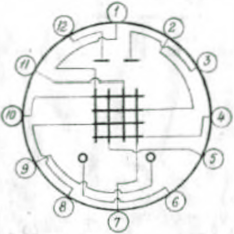
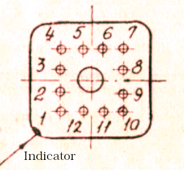
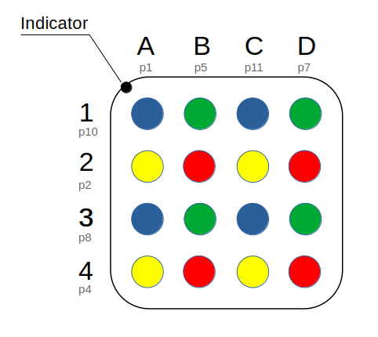

# ITM2-M (ИТМ2-М) Indicator / ITM2M (ИТМ2М) Indicator

Sign-synthesizing thyratron matrix indicator with low-voltage controlled by two inputs, in glass design, with flexible
leads, four-color is designed for building information display systems individual and collective use.

Label OKP 63 6441 5179

## Connection diagram of electrodes with leads

Pin layout (bottom view)

| Pin | Name of electrodes |
|----:|--------------------|
|   1 | Column A           |
|   2 | Row 2              |
|   3 | Second anode       |
|   4 | Row 4              |
|   5 | Column B           |
|   6 | Cathode            |
|   7 | Column D           |
|   8 | Row 3              |
|   9 | Sub-cathode        |
|  10 | Row 1              |
|  11 | Column C           |
|  12 | First anode        |

## Top view of the grid layout

### Basic electrical and photo technical parameters

<table>
<tr>
<td>Static unlocking voltage of the columns and rows of the grid</td>
<td>1.2 - 10</td>
<td>V</td>
</tr>
<tr>
<td>Pulse unlocking voltage of the columns and rows of the grid</td>
<td>1.2 - 10</td>
<td>V</td>
</tr>
<tr>
<td>Minium extinguishing voltage of the columns and rows if the grid</td>
<td>14</td>
<td>V</td>
</tr>
<tr>
<td>Maximum total preparatory discharge current</td>
<td>550</td>
<td>µA</td>
</tr>
<tr>
<td>Minimum cell glow brightness &nbsp;&nbsp;yellow &nbsp;&nbsp;green &nbsp;&nbsp;red &nbsp;&nbsp;blue</td>
<td>&nbsp; 200 400 200 100</td>
<td>&nbsp; cd/m2 cd/m2 cd/m2 cd/m2</td>
</tr>
<tr>
<td>Minimum Observation angle</td>
<td>±45</td>
<td>°</td>
</tr>
<tr>
<td>Maximum warmup time</td>
<td>90</td>
<td>s</td>
</tr>
</table>

## Maximum allowable electrical mode

<table>
<tr>
<td>Sub-cathode voltage</td>
<td>-280 - -250</td>
<td>V</td>
</tr>
<tr>
<td>Voltage on the 1st anole (constant or pulsating amplitude)</td>
<td>80 - 90</td>
<td>V</td>
</tr>
<tr>
<td>Voltage at the 2nd anode (constant or pulsating amplitude)</td>
<td>135 - 160</td>
<td></td>
</tr>
<tr>
<td>Minimum of simultaneous action of voltage pulses on the columns and rows of the grid, with a time shift between pulses less than 4μs</td>
<td>40</td>
<td>μs</td>
</tr>
<tr>
<td>Duration of quenching voltage pulses at anodes residual voltage on the 1st anode is not more than 4 V, on the 2nd anode more than 1.0 V</td>
<td>300-400</td>
<td>µs</td>
</tr>
</table>

Contains no precious metals.

Technical conditions of ODO.339.350 TU.

Zach. 1944-82

