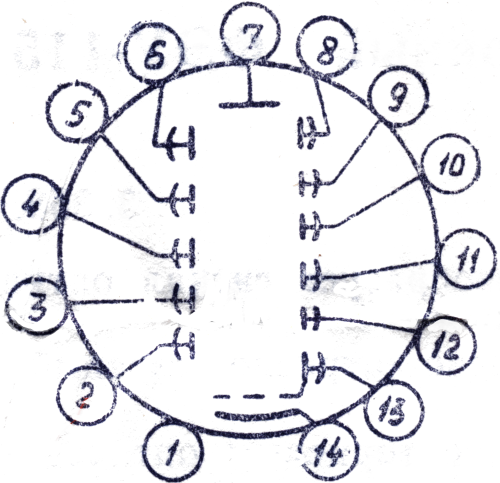
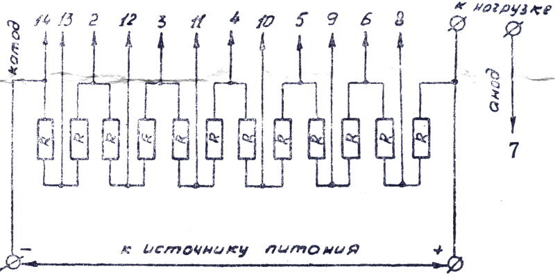

# Photomultiplier FEU-115 (ФЭУ-115)

No. 5433 
3.358.160 TU1

The FEU-115 photomultiplier converts the optical radiation signal into an electrical one.
PMT has a translucent antimony potassium sodium cesium photocathode and electrostatic focusing of electrons.
PMTs are made in a glass container, with an end optical input, with hard pins.
PMT is designed to indicate and measure weak light fluxes in special purpose equipment.

## Basic technical data (typical)

| Parameter                                                                                                                    |        Value        |      Unit      |
|------------------------------------------------------------------------------------------------------------------------------|:-------------------:|:--------------:|
| Spectral sensitivity area                                                                                                    |      360 - 850      |                | 
| Area of maximum spectral sensor1 activity                                                                                    |      400 - 450      |                |
| Number of amplification stages                                                                                               |         11          |                |
| Photocathode working surface diameter (reference)                                                                            |         25          |                |
| Maximum diameter                                                                                                             |         30          |       mm       |
| Maximum length                                                                                                               |         90          |       mm       |
| Maximum weight                                                                                                               |         50          |       g        |
| Working position                                                                                                             |         Any         |                |
| Minimum operating time                                                                                                       |        1600         |       h        |
| Criteria:                                                                                                                    |                     |                |
| &nbsp;&nbsp; maximum light anode sensitivity at cathode voltage                                                              |                     |                |
| &nbsp;&nbsp;&nbsp;&nbsp;1450 V                                                                                               |          3          |      A/lm      | 
| &nbsp;&nbsp;&nbsp;&nbsp;1650 V                                                                                               |         10          |      A/lm      | 
| &nbsp;&nbsp;&nbsp;&nbsp;1850 V                                                                                               |         30          |      A/lm      |
| &nbsp;&nbsp;light equivalent of current noise from the background luminous flux current equal to 1•10-6 lm     | 2.2•10-9 | $lm/\sqrt{Hz}$ |
| Shelf life in a heated storage or air-conditioned storage, as well as PMTs built into protected equipment or as a set ZIP |         12          |      year      |

For other storage conditions, the allowable periods are indicated in the table:

<table>
<thead>
<tr>
<td rowspan="2" style="text-align: center">Place of storage according GOST V 9.003-72</td>
<td colspan="2" style="text-align: center">Maximum term (years)</td>
</tr>
<tr>
<td style="text-align: center">In supplier's packaging</td>
<td style="text-align: center">Built into equipment (as part of an unprotected object)</td>
</tr>
</thead>
<tbody>
<tr>
<td>Unheated storage</td>
<td style="text-align: center">6</td>
<td style="text-align: center">6</td>
</tr>
<tr>
<td>Under a canopy</td>
<td style="text-align: center">6</td>
<td style="text-align: center">4</td>
</tr>
<tr>
<td>In the open area</td>
<td style="text-align: center">Storage not allowed</td>
<td style="text-align: center">4</td>
</tr>
</tbody>
</table>

Storage conditions according to GOST B 18348-73.

## Scheme of connecting electrodes with contacting elements (pins)

Pin arrangement
RSH 31 OST 11 P0.073.008-72

| Pin Number | Electrode Name |
|-----------:|----------------|
|          1 | Free           |
|          2 | 2nd day        |
|          3 | 4th dynode     |
|          4 | 6th dynode     |
|          5 | 8th dynode     |
|          6 | 10th dynode    |
|          7 | Anode          |
|          8 | 11th dynode    |
|          9 | 9th dynode     |
|         10 | 7th dynode     |
|         11 | 5th dynode     |
|         12 | 3rd dynode     |
|         13 | 1st dynode     |
|         14 | Cathode        |

It is forbidden to use the free petals of the lamp panels and the free leads of the PMT as reference points for mounting.

## Typical voltage divider circuit

Voltage divider - uniform.
Maximum divider link resistance (R) 0.3 MΩ.
It is allowed to replace the divider links R with separate power supplies with an maximum internal resistance of 0.3 MΩ.

## Multiplier Options

| Parameter                                                                                                                                       |         Value         |      Unit       |
|-------------------------------------------------------------------------------------------------------------------------------------------------|:---------------------:|:---------------:|
| Photocathode light sensitivity                                                                                                                  |  8.6•10-5  |      A/lm       |
| Unevenness of light anode sensitivity cathode                                                                                                   |           8           |       \%        |
| Light noise equivalent of dark anode current at anode light sensitivity of 10 A/lm                                                              | 0.12•10-12 | $lm/\sqrt{Hz}$  |
| The light equivalent of current noise from the background luminous flux is equal to 1•10-6 lm at light anode sensitivity 10 A/lm | 0.82•10-10 | $lm/\sqrt{Hz}$  |

| Light anode sensitivity (A/lm) | Voltage cathode - anode (V) | Dark anode current (A) |
|:------------------------------:|:---------------------------:|:----------------------:|
|               3                |            1060             |   1•10-10   |
|               10               |            1240             |                        |
|               30               |            1380             |                        |

## Limit values for permissible electrical operating modes

<table>
<tbody>
<tr>
<td rowspan="2" style="text-align: center">Limit</td>
<td style="text-align: center">Average anode current (A)</td>
<td style="text-align: center">Voltage cathode - anode (V)</td>
</tr>
<tr>
<td style="text-align: center">Ia ep. prev</td>
<td style="text-align: center">Uk - a before</td>
</tr>
<tr>
<td style="text-align: center">Maximum</td>
<td style="text-align: center">2.5•10-4</td>
<td style="text-align: center">1.05•USa - 30</td>
</tr>
</tbody>
</table>
USa - 30 - voltage corresponding to light anode sensitivity 30 A/lm.

## Instructions for use and operation

PMT operation is permitted in accordance with the instructions and recommendations set out in GOST B 21131-75 and OST 11 0423-87 with the following addition.
1. Before operation, store the PMT in the dark.

## Supplier guarantees

The supplier guarantees the compliance of each PMT supplied with all the requirements of the technical specifications during the shelf life (12 years) or minimum operating time (1500 hours) within the shelf life, provided that the consumer observes the operating modes and conditions, storage and transportation rules, as well as instructions for use, installation and operation, established by the technical conditions.

Test date: 1991-03-11 
OTC stamp

Customer representative stamp

We ask you to return the passport to the supplier after the end of the operation of the PMT, providing the following information:
* Number of actual working hours
* Basic operating mode data
* Cause of failure
* Additional information

Date 
Signature

Zach. 2166-90

